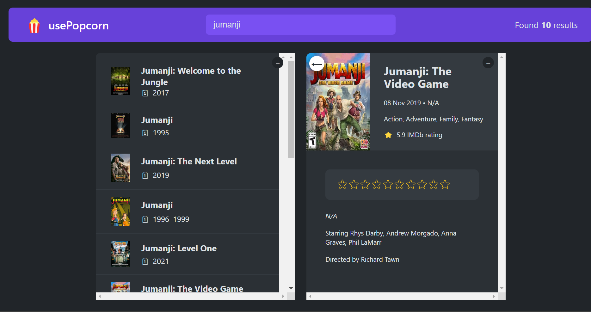

# usePopcorn 🍿

Welcome to the usePopcorn repository! Your go-to solution for managing movie data with custom hooks! 🎬

  

## Description 📝

usePopcorn is a React application built with custom hooks to simplify data fetching and management for movie-related information. With its efficient use of useEffect and custom hooks, it provides a seamless experience for retrieving and displaying movie data.

## Key Features 🌟

- **Efficient Data Fetching**: Utilizes useEffect for efficient data fetching and updating.
- **Custom Hooks**: Implements custom hooks to encapsulate and reuse logic for movie data management.
- **Dynamic Rendering**: Dynamically renders movie information based on user interactions and data updates.
- **Seamless Integration**: Easily integrate usePopcorn into your React applications for managing movie-related data.

## Technologies Used 🛠️

- **React**: JavaScript library for building user interfaces.
- **Custom Hooks**: Implement custom hooks for encapsulating and reusing logic.
- **useEffect**: Utilize useEffect for managing side effects such as data fetching and updates.
- **Git version control**: For secure and efficient code management.
- **Visual Studio Code**: Reliable code editor for development tasks.

